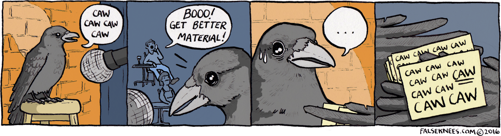

  
 

    <a href="">

# Welcome to my profile ! I'm Yann, aka CravetheFlame 

## I'm a former social sciences and statistics student turning into a Data scientist !

- 👨‍💻 I’m currently working on improving on my skills in Machine Learning - and actively looking for a job at the same time !
- 📚 I’m currently learning everything about neural network ! 
---

### Languages and Tools 🛠 

